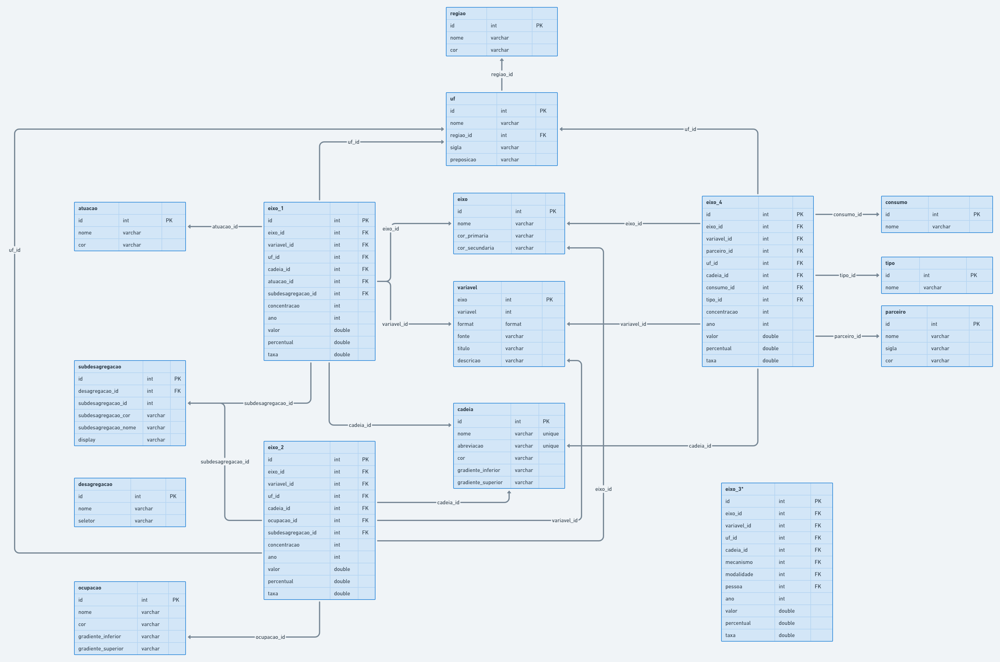

# Atlas OBEC

Atlas econômico da cultura brasileira (OBEC - UFRGS)

- [Atlas OBEC](#atlas-obec)
  - [Tecnologias utilizadas](#tecnologias-utilizadas)
  - [Documentação para instalação e execução do Atlas](#documentação-para-instalação-e-execução-do-atlas)
    - [Instalação via docker](#instalação-via-docker)
    - [Instalação sem docker](#instalação-sem-docker)
  - [Requisitos e Funcionalidades](#requisitos-e-funcionalidades)
  - [DER](#der)
  - [Banco de Dados](#banco-de-dados)
  - [Utilidades](#utilidades)
    - [Adicionando Novos Pacotes ao Projeto](#adicionando-novos-pacotes-ao-projeto)
## Tecnologias utilizadas

Adicionando Novos Pacotes ao Projeto

* React (^17.0.2)
* NPM (6.14.12)
* NodeJS (v14.16.1)
* Typescript (^4.1.2)
* Docker Engine (v20.10.8)
* Docker Compose (3.7)

*Outras bibliotecas e frameworks:*
* axios: biblioteca para configuração de cliente HTTP
* styled-somponents: biblioteca para estilização de componentes React
* eslint e prettier: biblioteca para lint de código
* d3: biblioteca para manipulação do DOM e desenho dos gráficos/mapas
* topojson-client: biblioteca para manipulação de coordenadas para criação de mapas

## Documentação para instalação e execução do Atlas

### Instalação via docker

*Requisito(s): Docker Engine e Docker Compose*

* Criar uma cópia do arquivo `docker-compose.example.yml` e renomear para `docker-compose.yml`
* Adicionar na seção *enviroments* do arquivo criado, caso necessário, as variáveis de ambiente (por exemplo, host do backend)
* Rodar o comando `docker-compose up` na pasta raiz do projeto

### Instalação sem docker

* WIP

## Requisitos e Funcionalidades

* WIP

## DER

## Banco de Dados

* WIP

## Utilidades

### Adicionando Novos Pacotes ao Projeto

Os pacotes do frontend são instalados dentro da própria imagem docker, o que requer alguns passos extras na hora de adicionar bibliotecas ao projeto:

Instale os pacotes desejados, desenvolva e teste a aplicação fora do docker (usando `npm start`). Depois, rode os seguintes comandos:

1. `docker-compose rm app` Remove a imagem antiga, sem os novos pacotes
2. `docker-compose up --build` Reconstrói a imagem com os novos pacotes

